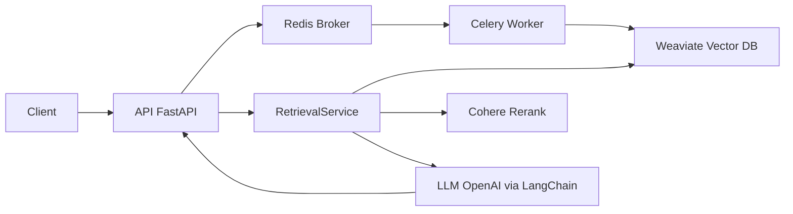

# Project Overview

This document provides a comprehensive, production-quality overview of the ONTO-RAG-V1 system: its purpose, architecture, pipelines, configuration, deployment, APIs, observability, testing approach, and known limitations. It cross-links to source code, existing documentation, and deployment artifacts with precise, clickable references.

- Application entrypoints: [src/app/main.py](src/app/main.py), [src/app/worker.py](src/app/worker.py)
- API endpoints: [ingest_ontology()](src/app/api/endpoints/ingest.py:17), [src/app/api/endpoints/query.py](src/app/api/endpoints/query.py), [query_ontology()](src/app/api/endpoints/query.py:25)
- Background processing: [process_ontology_task()](src/app/tasks/ontology_processor.py:14)
- Services: [IndexingService](src/app/services/indexing_service.py:12), [IndexingService.batch_index_chunks()](src/app/services/indexing_service.py:61), [RetrievalService](src/app/services/retrieval_service.py:12)
- Configuration and logging: [Settings](src/app/core/config.py:9), [setup_logging()](src/app/core/logging.py:12)
- Schemas: [IngestionResponse](src/app/schemas/models.py:8), [QueryRequest](src/app/schemas/models.py:31), [QueryResponse](src/app/schemas/models.py:39)
- Existing docs: [docs/ARCHITECTURE.md](docs/ARCHITECTURE.md), [docs/api/ingestion.md](docs/api/ingestion.md), [docs/api/query.md](docs/api/query.md), [docs/guides/configuration.md](docs/guides/configuration.md), [tutorials/ingest_tutorial.md](tutorials/ingest_tutorial.md), [tutorials/query_tutorial.md](tutorials/query_tutorial.md)
- Deployment artifacts: [docker-compose.yml](docker-compose.yml), [Dockerfile](Dockerfile), [requirements.txt](requirements.txt)

## 1. Executive Summary

ONTO-RAG-V1 ingests OWL and related ontology files, transforms them into markdown, chunks them semantically, indexes the chunks in a vector database, and serves a Retrieval-Augmented Generation (RAG) API over the indexed knowledge. Users can ingest ontologies asynchronously via the ingestion endpoint [ingest_ontology()](src/app/api/endpoints/ingest.py:17) and query them synchronously via the query endpoint [query_ontology()](src/app/api/endpoints/query.py:25). Internally, ingestion is executed by a Celery worker [process_ontology_task()](src/app/tasks/ontology_processor.py:14), indexing is handled by [IndexingService](src/app/services/indexing_service.py:12), and answering queries is handled by [RetrievalService](src/app/services/retrieval_service.py:12). The API is a FastAPI app [src/app/main.py](src/app/main.py); background tasks are run by a Celery worker [src/app/worker.py](src/app/worker.py).

Positioning: This system is a foundation for teams that need robust ontology ingestion and RAG-based querying over domain ontologies, with modular providers for vector search (Weaviate), re-ranking (Cohere), and LLM generation (OpenAI via LangChain).

## 2. Goals and Non-Goals

- Goals
  - Asynchronous ingestion pipeline converting OWL to Markdown, chunking, and batch indexing into a vector DB. See [process_ontology_task()](src/app/tasks/ontology_processor.py:14) and [IndexingService.batch_index_chunks()](src/app/services/indexing_service.py:61).
  - Real-time query pipeline: hybrid search in Weaviate, re-ranking via Cohere, answer generation via an LLM. See [RetrievalService.answer_query()](src/app/services/retrieval_service.py:63).
  - Clear configuration via environment variables loaded by [Settings](src/app/core/config.py:9) and examples in [app.env.example](app.env.example).
  - Containerized deployment and local orchestration via [docker-compose.yml](docker-compose.yml) and multi-stage [Dockerfile](Dockerfile).
  - Test coverage across unit, integration, and e2e tests. See [tests/unit/test_chunking.py](tests/unit/test_chunking.py), [tests/integration/test_api.py](tests/integration/test_api.py), and [tests/e2e/test_e2e.py](tests/e2e/test_e2e.py).

- Non-goals
  - Task status tracking endpoint for Celery jobs (explicitly out of scope in this version; see note in [tutorials/ingest_tutorial.md](tutorials/ingest_tutorial.md)).
  - A UI; this project exposes APIs only.
  - Pluggable multi-DB abstraction; current implementation targets Weaviate.

## 3. System Architecture Overview

- API (FastAPI): [src/app/main.py](src/app/main.py) registers routes and configures logging; endpoints live in [src/app/api/endpoints/ingest.py](src/app/api/endpoints/ingest.py) and [src/app/api/endpoints/query.py](src/app/api/endpoints/query.py).
- Worker (Celery): [src/app/worker.py](src/app/worker.py) initializes the Celery app [celery_app](src/app/worker.py:11) and loads tasks, including [process_ontology_task()](src/app/tasks/ontology_processor.py:14).
- Broker/Results (Redis): a durable message broker connecting API and Worker ([docker-compose.yml](docker-compose.yml)).
- Vector DB (Weaviate): hybrid vector and keyword search with modules text2vec-openai and reranker-cohere ([docker-compose.yml](docker-compose.yml)).

High-level component diagram

For additional architectural depth, see [docs/ARCHITECTURE.md](docs/ARCHITECTURE.md).

## 4. Pipelines

### 4.1 Ingestion Pipeline Dataflow

- HTTP POST to [ingest_ontology()](src/app/api/endpoints/ingest.py:17)
  - Uploads the ontology file, stores it temporarily, and dispatches a Celery task to process it.
- Background task: [process_ontology_task()](src/app/tasks/ontology_processor.py:14)
  - Initializes [IndexingService](src/app/services/indexing_service.py:12) and optionally deletes existing data via [IndexingService.delete_by_ontology_id()](src/app/services/indexing_service.py:49) when is_update is true.
  - Converts ontology to Markdown using pylode.
  - Chunks Markdown into semantically coherent sections using a markdown header splitter.
  - Batch indexes chunks using [IndexingService.batch_index_chunks()](src/app/services/indexing_service.py:61) into Weaviate.

Key indexing schema creation occurs in [IndexingService.create_schema_if_not_exists()](src/app/services/indexing_service.py:23), where vectorizer and reranker modules are set for the class schema.

Further reference: [docs/api/ingestion.md](docs/api/ingestion.md), [tutorials/ingest_tutorial.md](tutorials/ingest_tutorial.md).

### 4.2 Query Pipeline Dataflow

- API endpoint [query_ontology()](src/app/api/endpoints/query.py:25) receives a [QueryRequest](src/app/schemas/models.py:31) and delegates to [RetrievalService.answer_query()](src/app/services/retrieval_service.py:63).
- [RetrievalService._hybrid_search()](src/app/services/retrieval_service.py:101) retrieves candidates from Weaviate using hybrid search.
- [RetrievalService._rerank()](src/app/services/retrieval_service.py:113) re-ranks the candidates via Cohere.
- The top-k chunks are formatted into a prompt and sent to the configured LLM (OpenAI via LangChain) to generate the final [QueryResponse](src/app/schemas/models.py:39).

Reference: [docs/api/query.md](docs/api/query.md), [tutorials/query_tutorial.md](tutorials/query_tutorial.md).

## 5. Configuration

Configuration is managed by Pydantic [Settings](src/app/core/config.py:9) and a shared instance [settings](src/app/core/config.py:57). Example values are provided in [app.env.example](app.env.example); environment variables are also passed into containers via [docker-compose.yml](docker-compose.yml).

Key settings summary (see [docs/guides/configuration.md](docs/guides/configuration.md) for the full table):

- Core
  - APP_ENV: development or production.
- Weaviate
  - WEAVIATE_URL, WEAVIATE_API_KEY, WEAVIATE_CLASS_NAME.
- Cohere
  - COHERE_API_KEY, optional COHERE_BASE_URL.
- OpenAI
  - OPENAI_API_KEY for LLM.
  - OPENAI_LLM_API_KEY and OPENAI_LLM_BASE_URL for LLM overrides in [RetrievalService.__init__()](src/app/services/retrieval_service.py:13).
  - OPENAI_EMBEDDINGS_API_KEY and OPENAI_EMBEDDINGS_BASE_URL for embeddings used by Weaviate.
- Redis/Celery
  - REDIS_URL, CELERY_BROKER_URL, CELERY_RESULT_BACKEND.
- Model defaults
  - DEFAULT_LLM_MODEL, DEFAULT_RERANKING_MODEL, EMBEDDING_MODEL.

Vectorizer and reranker configuration
- The Weaviate class schema is created in [IndexingService.create_schema_if_not_exists()](src/app/services/indexing_service.py:23) with:
  - vectorizer: text2vec-openai
  - reranker: reranker-cohere
- Weaviate is started with these modules enabled and configured in [docker-compose.yml](docker-compose.yml) (ENABLE_MODULES, OPENAI_APIKEY, COHERE_APIKEY, etc.).
- In queries, Weaviate’s hybrid search is used in [RetrievalService._hybrid_search()](src/app/services/retrieval_service.py:101), Cohere is used in [RetrievalService._rerank()](src/app/services/retrieval_service.py:113), and OpenAI LLM is created in [RetrievalService.__init__()](src/app/services/retrieval_service.py:13).

## 6. Deployment and Operations

- Docker Compose
  - Start the full stack: docker compose up --build -d
  - Services:
    - API: FastAPI server serving / and /api/v1 routes. See [src/app/main.py](src/app/main.py).
    - Worker: Celery worker consuming ingestion tasks. See [src/app/worker.py](src/app/worker.py).
    - Weaviate: semitechnologies/weaviate:1.24.1 with text2vec-openai and reranker-cohere enabled. See [docker-compose.yml](docker-compose.yml).
    - Redis: broker and result backend for Celery. See [docker-compose.yml](docker-compose.yml).
- Dockerfile
  - Multi-stage build installing dependencies in a venv in the builder stage, then copying to a slim runtime image. See [Dockerfile](Dockerfile).
- Local development without Docker
  - Script: [scripts/run_local.sh](scripts/run_local.sh) starts Uvicorn and a Celery worker; ensure external Redis and Weaviate are running locally (see its pre-run notes).
- Health checks
  - API readiness can be approximated by the root endpoint [read_root()](src/app/main.py:39) returning status ok.
  - The E2E runner [scripts/run_e2e_tests.sh](scripts/run_e2e_tests.sh) actively polls the root URL for readiness before testing.

## 7. APIs and Links

- Ingestion
  - Endpoint: [ingest_ontology()](src/app/api/endpoints/ingest.py:17)
  - API reference: [docs/api/ingestion.md](docs/api/ingestion.md)
  - Response model: [IngestionResponse](src/app/schemas/models.py:8)
  - Asynchronous processing by [process_ontology_task()](src/app/tasks/ontology_processor.py:14)
- Query
  - Endpoint: [query_ontology()](src/app/api/endpoints/query.py:25) with dependency injection via [get_retrieval_service()](src/app/api/endpoints/query.py:11)
  - API reference: [docs/api/query.md](docs/api/query.md)
  - Response model: [QueryResponse](src/app/schemas/models.py:39), containing [SourceChunk](src/app/schemas/models.py:22)

## 8. Observability and Logging

Logging configuration is centralized in [setup_logging()](src/app/core/logging.py:12). In development (APP_ENV=development), human-readable logs are emitted; in other environments, logs are formatted as JSON using [CustomJsonFormatter](src/app/core/logging.py:6). Application startup, shutdown, and key pipeline stages log to stdout.

- API logs: docker compose logs -f api
- Worker logs: docker compose logs -f worker
- Weaviate logs: docker compose logs -f weaviate
- Redis logs: docker compose logs -f redis

Each log stream will include structured fields when APP_ENV is not development.

## 9. Testing

- Unit tests
  - Chunking logic and schema models are covered in [tests/unit/test_chunking.py](tests/unit/test_chunking.py) and [tests/unit/test_schemas.py](tests/unit/test_schemas.py).
- Integration tests
  - API endpoint behavior, request validation, and Celery dispatch mocking in [tests/integration/test_api.py](tests/integration/test_api.py).
- End-to-end tests
  - Full ingestion and query flow against a running stack in [tests/e2e/test_e2e.py](tests/e2e/test_e2e.py).
- Test runners
  - Unit + integration: [scripts/run_tests.sh](scripts/run_tests.sh)
  - E2E: [scripts/run_e2e_tests.sh](scripts/run_e2e_tests.sh)

## 10. Known Limitations and Future Work

- Weaviate client version alignment
  - The code utilizes v3-style client and query patterns, e.g., [IndexingService.__init__()](src/app/services/indexing_service.py:16) uses weaviate.Client(url), [RetrievalService._hybrid_search()](src/app/services/retrieval_service.py:101) uses query.get(...).with_hybrid(...). These are not compatible with the v4 Python client. Because [requirements.txt](requirements.txt) does not pin weaviate-client to a v3 version, installations may resolve to v4 by default, causing runtime errors. Recommendation: pin weaviate-client to a 3.x version compatible with current code or refactor to the v4 API and operations model.
- Limited task lifecycle observability
  - There is no endpoint to poll Celery task status; E2E tests mitigate by sleeping. Future work: add a task status endpoint and persistence for task metadata.
- Schema management
  - Current schema creation is centralized in [IndexingService.create_schema_if_not_exists()](src/app/services/indexing_service.py:23). Consider migrations and versioned schema strategies for production scenarios.

## 11. Cross-links

- Deeper architecture: [docs/ARCHITECTURE.md](docs/ARCHITECTURE.md)
- API references: [docs/api/ingestion.md](docs/api/ingestion.md), [docs/api/query.md](docs/api/query.md)
- Configuration guide: [docs/guides/configuration.md](docs/guides/configuration.md)
- Tutorials: [tutorials/ingest_tutorial.md](tutorials/ingest_tutorial.md), [tutorials/query_tutorial.md](tutorials/query_tutorial.md)

## 12. Appendix: Key Code Entry Points and Models

- Application entrypoints
  - FastAPI app: [src/app/main.py](src/app/main.py), [startup_event()](src/app/main.py:25), [shutdown_event()](src/app/main.py:33), [read_root()](src/app/main.py:39)
  - Celery worker: [src/app/worker.py](src/app/worker.py), [celery_app](src/app/worker.py:11)
- API endpoints
  - Ingestion: [ingest_ontology()](src/app/api/endpoints/ingest.py:17)
  - Query: [query_ontology()](src/app/api/endpoints/query.py:25), DI factory [get_retrieval_service()](src/app/api/endpoints/query.py:11)
- Background task
  - [process_ontology_task()](src/app/tasks/ontology_processor.py:14)
- Services
  - Indexing: [IndexingService](src/app/services/indexing_service.py:12), [IndexingService.create_schema_if_not_exists()](src/app/services/indexing_service.py:23), [IndexingService.batch_index_chunks()](src/app/services/indexing_service.py:61)
  - Retrieval: [RetrievalService](src/app/services/retrieval_service.py:12), [RetrievalService.answer_query()](src/app/services/retrieval_service.py:63)
- Core
  - Configuration: [Settings](src/app/core/config.py:9), [settings](src/app/core/config.py:57)
  - Logging: [setup_logging()](src/app/core/logging.py:12)
- Schemas
  - [IngestionResponse](src/app/schemas/models.py:8), [QueryRequest](src/app/schemas/models.py:31), [QueryResponse](src/app/schemas/models.py:39), [SourceChunk](src/app/schemas/models.py:22)

---
